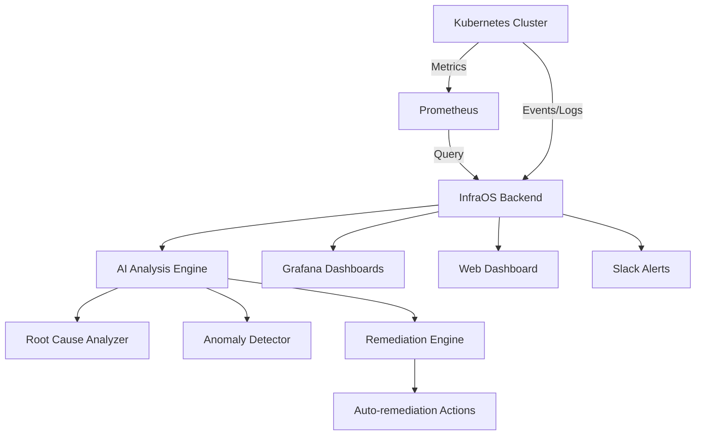

# InfraOS AI — AI DevOps Infrastructure Platform

> Kubernetes monitoring, AI root-cause analysis, predictive alerts, and automated remediation — your AI-powered DevOps copilot.

[](LICENSE)
[](https://python.org)

## Features

- [x] Kubernetes cluster monitoring (pods, nodes, services)
- [x] Deployment rollout tracking
- [x] AI root-cause analysis ("why is my pod crashing?")
- [x] Natural language K8s queries
- [x] Prometheus metrics integration
- [x] Grafana dashboard integration
- [x] Predictive anomaly detection
- [x] Automated remediation workflows
- [x] Slack / webhook alerting
- [x] Mock mode (works without a real cluster)

## Architecture



## Tech Stack

| Layer | Technology |
|-------|-----------|
| Backend | FastAPI, Python 3.11+ |
| K8s Client | kubernetes-python |
| Metrics | Prometheus + prometheus-client |
| Visualization | Grafana (official image) |
| AI | OpenAI GPT-4 / Anthropic Claude |
| ML | scikit-learn (anomaly detection) |
| Frontend | React 18, Recharts, Tailwind |

## Quick Start

```bash
git clone https://github.com/yourusername/infra-os
cd infra-os
cp .env.example .env
# Set K8S_MOCK_MODE=true if you don't have a cluster
docker-compose up --build
```

Open `http://localhost:3000` for the dashboard, `http://localhost:3001` for Grafana, `http://localhost:9090` for Prometheus.

## Mock Mode

Set `K8S_MOCK_MODE=true` in `.env` to run with realistic fake cluster data — no Kubernetes cluster required.

## License

MIT — see [LICENSE](LICENSE).
