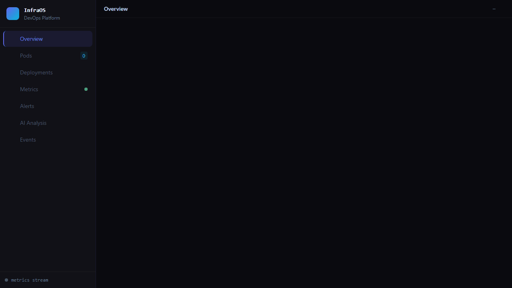
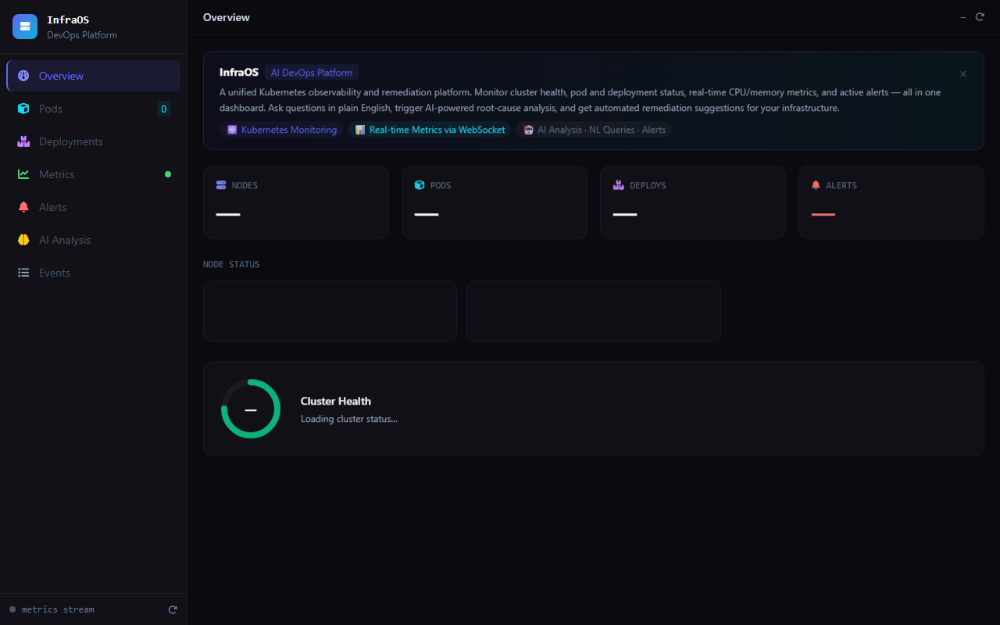
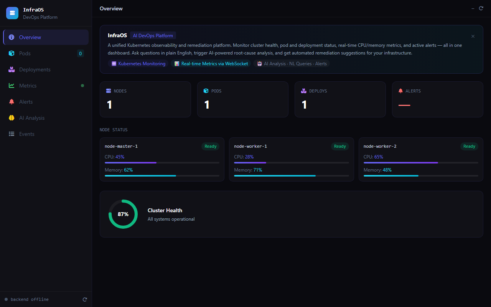
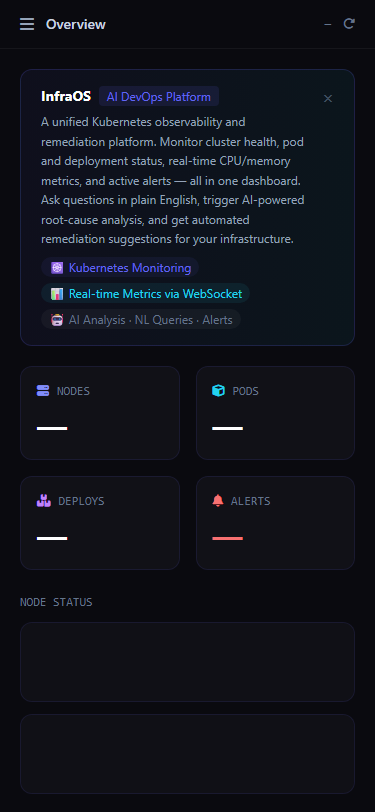

# InfraOS AI

[](https://github.com/isidhartha/infra-os/discussions)

## Demo



### Screenshots

| Desktop | Feature View | Mobile |
|---------|-------------|--------|
|  |  |  |


I was on-call for a service once and got paged at 2am for a Kubernetes cluster that was falling apart in three different ways simultaneously. I spent 45 minutes running `kubectl` commands to understand what was happening before I could even start fixing it. InfraOS AI is my answer to that problem.

It's a DevOps operations platform that connects to your Kubernetes cluster, pulls in everything that's happening — pods, deployments, resource usage, events, Prometheus metrics — and gives you an AI layer to make sense of it all. You can ask "why is this pod crashing?" in plain English and get a real answer, not a wall of log output to parse yourself.

---

## What it does

**Cluster monitoring** — Live view of your nodes, pods, deployments, and services. Health status, restart counts, resource requests vs. limits. Everything in one dashboard rather than spread across ten kubectl commands.

**Natural language queries** — Ask questions about your cluster in plain English. "Which pods have restarted more than 5 times in the last hour?" or "What's consuming the most memory in the production namespace?" — it translates these into the right queries and gives you the answer.

**Root cause analysis** — When something breaks, tell it what happened and it traces back through events, logs, and metrics to figure out why. It's not magic — it looks at the same signals you'd look at manually, just faster and with an AI to synthesize them.

**Anomaly detection** — Watches your metrics over time and flags things that look unusual before they become incidents. High memory growth rate, unusual request patterns, CPU spikes that don't match your normal traffic pattern.

**Automated remediation** — For common problems it can take action directly: restart a crashed pod, scale a deployment up or down, cordon a misbehaving node. Every action gets logged and can trigger a Slack notification.

**Prometheus and Grafana** — Built-in integration with both. Grafana runs as part of the Docker Compose stack. Prometheus scrapes whatever you point it at.

**Mock mode** — No Kubernetes cluster? No problem. Set `K8S_MOCK_MODE=true` and the platform generates realistic fake cluster data. Useful for exploring the UI, testing your alerting rules, or demoing to someone.

---

## How to run it

**Prerequisites**: Docker and Docker Compose. An OpenAI API key for the AI features.

**1. Clone the repo**

```bash
git clone https://github.com/isidhartha/infra-os.git
cd infra-os
```

**2. Configure**

```bash
cp .env.example .env
```

Edit `.env`. The important ones:

```
OPENAI_API_KEY=sk-your-key-here
K8S_MOCK_MODE=true          # set to false if you have a real cluster
```

If you have a real cluster, you'll also need to set `K8S_CONFIG_PATH` to your kubeconfig file path.

**3. Start everything**

```bash
docker-compose up --build
```

This starts the backend, Prometheus, Grafana, and the frontend. First build takes a few minutes.

**4. Open the dashboards**

| Service | URL |
|---|---|
| InfraOS Dashboard | http://localhost:3000 |
| Grafana | http://localhost:3001 |
| Prometheus | http://localhost:9090 |
| API | http://localhost:8000 |

---

## Connecting a real cluster

Set `K8S_MOCK_MODE=false` in `.env` and mount your kubeconfig:

```yaml
# In docker-compose.yml, under the backend service:

[](https://github.com/isidhartha/infra-os/discussions)
volumes:
  - ~/.kube:/root/.kube:ro
```

The backend uses the standard kubeconfig format. Whatever `kubectl` can reach, InfraOS can reach.

---

## API

Swagger UI at `http://localhost:8000/docs`.

```
GET  /api/v1/k8s/cluster         — Cluster overview
GET  /api/v1/k8s/pods            — List pods (filter by namespace)
GET  /api/v1/k8s/deployments     — List deployments
POST /api/v1/k8s/nl-query        — Natural language query
POST /api/v1/incident/analyze    — Root cause analysis
POST /api/v1/remediate           — Execute a remediation action
GET  /api/v1/alerts              — Active alerts
GET  /api/v1/metrics/snapshot    — Current metrics snapshot
WS   /ws/metrics                 — Real-time metrics stream
```

---

## Configuration

| Variable | Description | Default |
|---|---|---|
| `OPENAI_API_KEY` | For AI analysis and NL queries | — |
| `K8S_MOCK_MODE` | Run with fake cluster data | `true` |
| `PROMETHEUS_URL` | Prometheus endpoint | `http://prometheus:9090` |
| `GRAFANA_URL` | Grafana endpoint | `http://grafana:3000` |
| `SLACK_WEBHOOK_URL` | Slack notifications for remediations | — |
| `POD_RESTART_WARNING_THRESHOLD` | Alert when a pod restarts this many times | `5` |

---

## Free local LLM option (no API key needed)

InfraOS AI can run its AI features entirely on your machine using [Ollama](https://ollama.com) — no OpenAI account or API key required.

**1. Install Ollama**

Download from https://ollama.com and install it. Then pull a model:

```bash
ollama pull llama3.2
```

**2. Set the provider in `.env`**

```
LLM_PROVIDER=ollama
OLLAMA_BASE_URL=http://localhost:11434
OLLAMA_MODEL=llama3.2
```

Leave `OPENAI_API_KEY` blank. The backend will route all AI calls to your local Ollama instance instead.

**3. Start Ollama and then the stack**

```bash
ollama serve          # keep this running in one terminal
docker-compose up --build
```

If you're running Ollama on your host machine and the backend inside Docker, the compose file already sets `OLLAMA_BASE_URL=http://host.docker.internal:11434` so the container can reach it. On Linux, you may need to use your host's LAN IP instead of `host.docker.internal`.

**Switching back to OpenAI** is just changing `LLM_PROVIDER=openai` in `.env` and restarting the backend.

---

## License

MIT. Run it on your own infrastructure, fork it, build on top of it.
